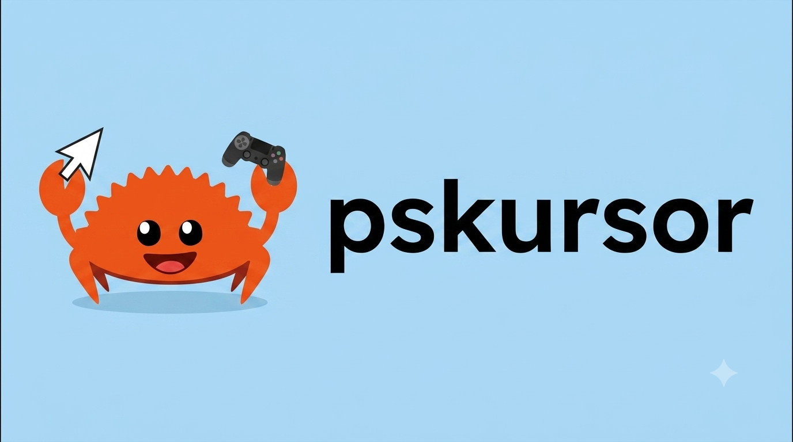

# pskursor

    

pskursor is a simple Linux device driver written in Rust. It lets you use your gamepads and controllers to control your mouse cursor, making it fun to navigate your desktop without a mouse.

## Features

1. Leverages HIDAPI for bluetooth and USB device detection.
2. Linux native api integration for mouse movement control.
3. Implemented in rust, so you know its blazingly fast...

## License

This project is licensed under the GNU General Public License, Version 2.

    Made with ❤️ by <a href="https://www.linkedin.com/in/syed-vilayat-ali-rizvi">me</a>

